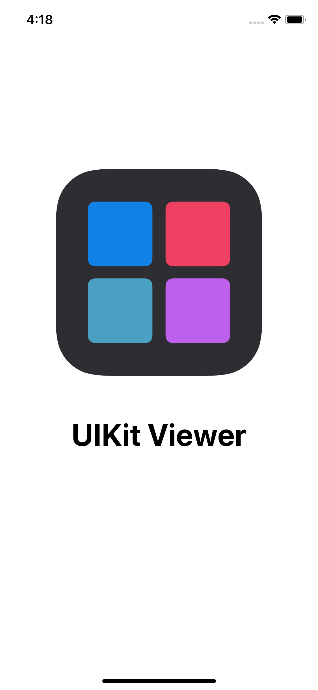
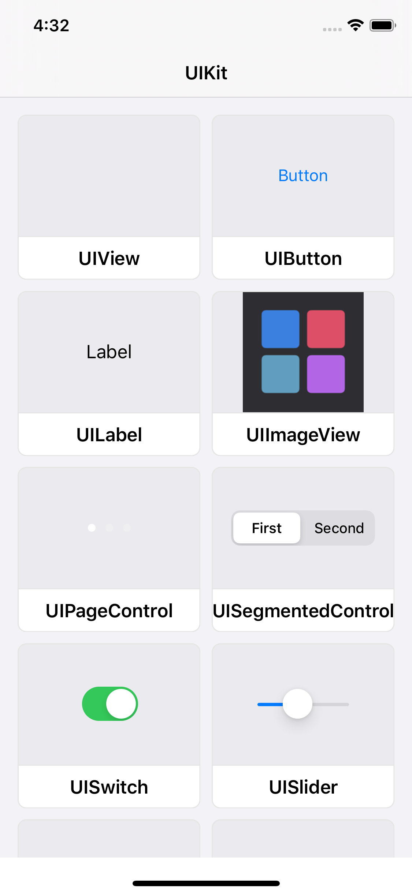
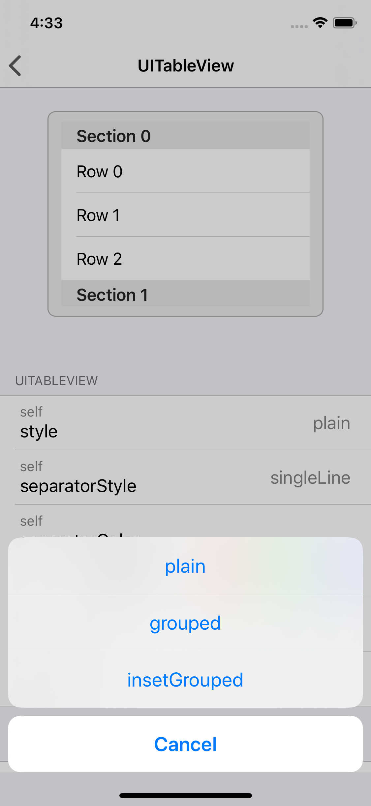
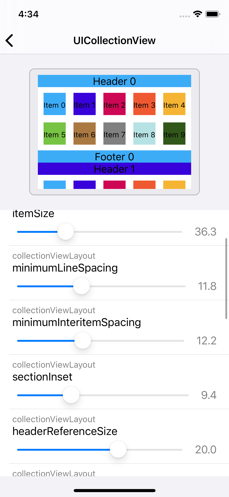
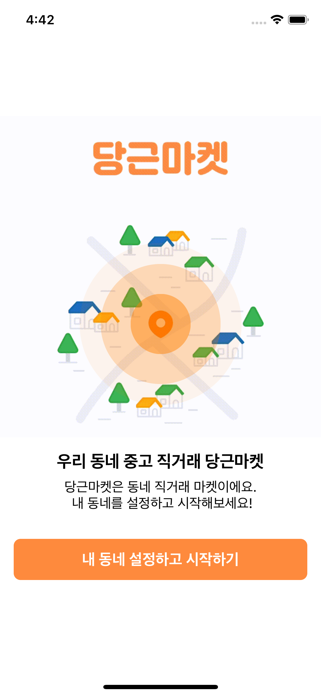
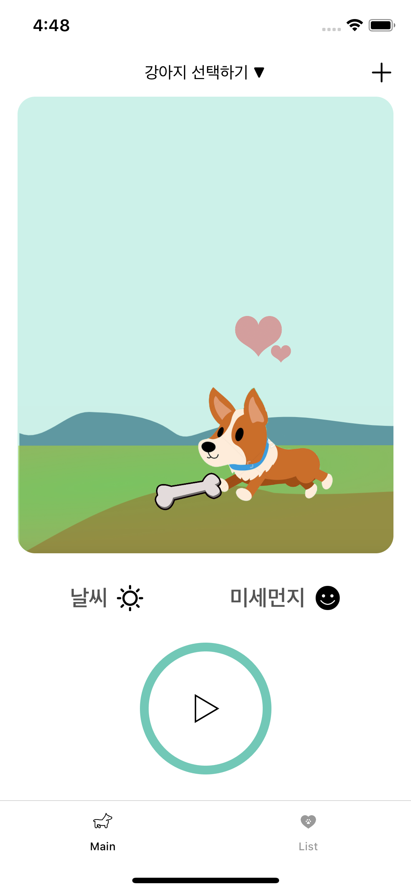
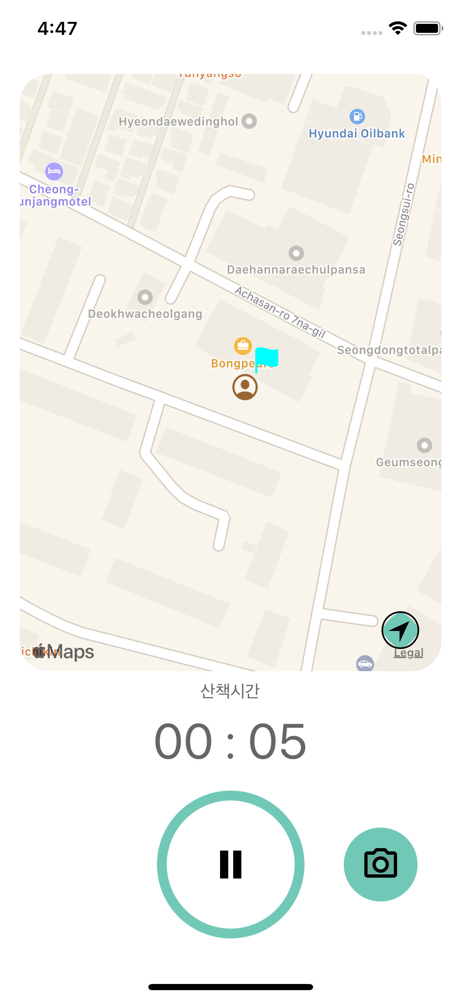
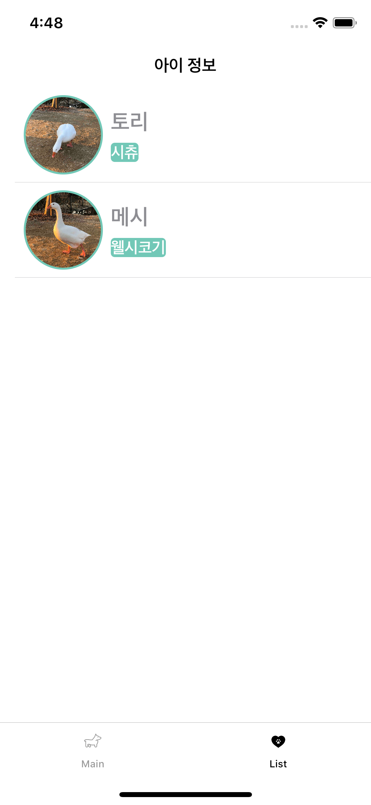

# 김참솔(Chamsol Kim)

- Email : kcsol1005@gmail.com
- Github : https://github.com/cskime
- Blog : https://cskime.github.io

## Table Of Contents

- [Career](https://github.com/cskime/Portfolio#career)
  - FastCampus iOS School 10th
  - (주) 디딤
- [Projects](https://github.com/cskime/Portfolio#projects)
  - UIKitViewer
  - 당근마켓 clone
  - Let's Mung!
  - Femora

## Career

- FastCampus iOS School 10th (2019.11 ~ 2020.04)
  - [FastCampus iOS Study Log](https://github.com/cskime/iOS-Study-Log)
  - [Swift study](https://github.com/TheSwifters/iOS-Study)
- (주)디딤 iOS 개발 (2018.11 ~ 2019.07)
- 충북대학교 전자공학 및 스마트자동차공학 전공 : 2011.03 ~ 2019.02
  - [졸업작품: Image Processing을 활용한 자율 주차 시스템](https://github.com/cskime/GraduationProject)

## Projects

### UIKitViewer

> FastCampus에서 진행한 팀 해커톤 프로젝트. 자체 평가 1위!
>
> UIKit Framework에 있는 UI 객체들의 속성과, 그 속성을 변경했을 때 UI 변화를 관찰할 수 있는 공부용 앱
>
> [App Store](https://apps.apple.com/kr/app/uikitviewer/id1509137201) v1.0 출시

- 기간 : 2020.02.05 ~ 2020.02.07
- 역할 : 핵심 기능 개발(LoC[1](#footnote1) 90%)
- 사용기술 : Swift, UIKit
- [Show Detail](https://github.com/cskime/UIKit-Viewer) 👀

  

    
    
    
    
  

### 당근마켓 Clone

> FastCampus에서 진행한 Backend 개발자와의 협업 프로젝트
>
> 무료 앱 1위를 기록하는 당근마켓의 iOS 앱을 clone

- 기간 : 2020.03.31 ~ 2020.04.29
- 역할 : 푸시알림, 채팅, 문자인증 로그인 등 개발(LoC[1](#footnote1) 40%)
- 사용기술 : Swift, APNs, Firebase(Authorization, FCM)
- [Show Detail](https://github.com/cskime/iOS_DaangnMarket) 👀

  

    
    
    
    
  

### Let's Mung!

> FastCampus에서 진행한 팀 해커톤 프로젝트. 자체 평가 2위!
>
> 보호자에게도 강아지를 산책시킬 동기를 부여할 보상 시스템(reward)을 도입한 반려동물 산책 기록 앱
>
> UI 및 부족한 기능 보완중...

- 기간 : 2020.01.15 ~ 2020.01.17
- 역할 : Firebase 연결, 사용자 위치 기반 목적지 도착 기능(LoC[1](#footnote1) 65%)
- 사용기술 : Swift, Firebase(Database), CoreLocation
- [Show Detail](https://github.com/cskime/PetWalk) 👀

  

    
    
    
    
  

### Femora

> (주) 디딤에서 개발한 Unity 기반 iPad용 iOS application

- 기간 : 2018.11 ~ 2019.04
- 역할 : iPad용 iOS 앱 개발
- 사용기술 : Swift, Objective-C, C#, Unity, SQLite

  

---

<b id="footnote1">0</b> Work In Progress. 작업중 [↩︎](#sup1)
<b id="footnote2">1</b> Level of Contribution. 기여도 [↩︎](#sup2)

