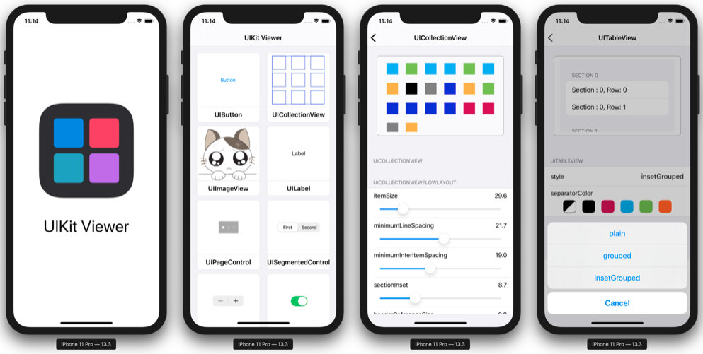
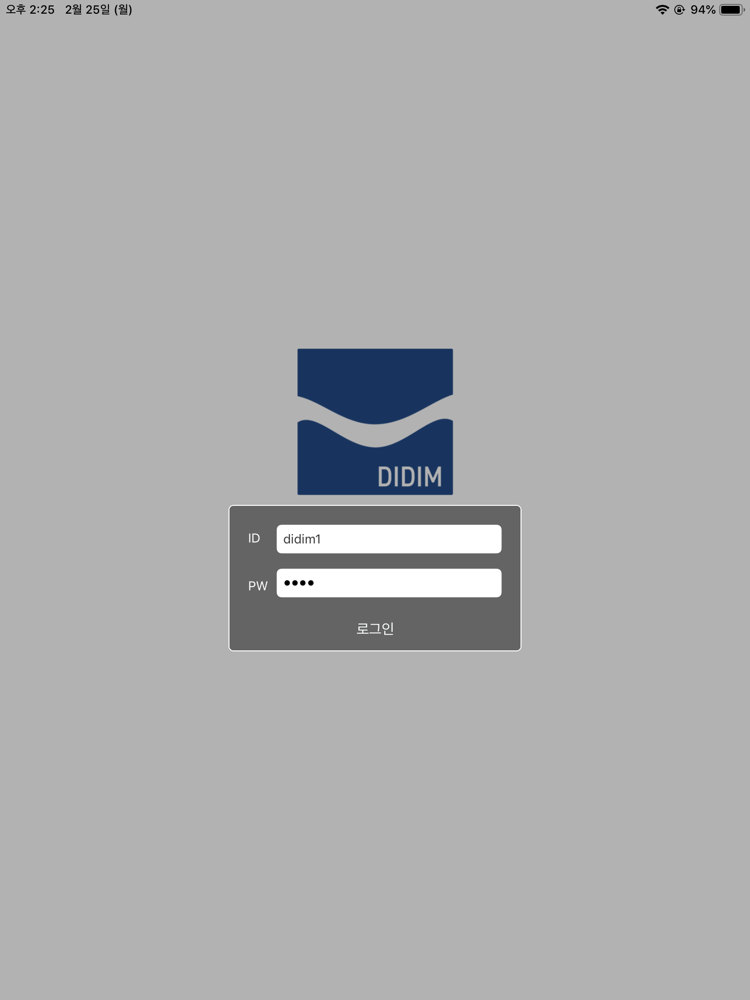

# 김참솔(Chamsol Kim)

- 🐙 [My Github](https://github.com/cskime), [Dev Crew](https://github.com/TheSwifters)
- 💻 [Blog](https://cskime.github.io)
- 📝 [Resume]() : WIP[^1]
- 📞 [Contact Me](https://github.com/cskime/Introduce#Contact)

## Activity

- **(주)디딤 iOS 개발** : 2018.11 ~ 2019.07
  - iOS app on iPad
  - Swift, Objective-C, C#, SQLite, Git
- **FastCampus iOS School 10th 수료** : 2019.11 ~ 2020.04
- **충북대학교 스마트자동차공학 연계전공** : 2011.03 ~ 2019.02
  - [졸업작품: Image Processing을 활용한 자율 주차 시스템](https://github.com/cskime/GraduationProject)
  - C/C++, Arduino
- **충북대학교 전자공학 전공** : 2017.09 ~ 2019.02

## Projects

### UIKit Viewer

- Description
  - UIKit Framework에 있는 UI 객체들의 속성과, 그 속성을 변경했을 때 UI 변화를 관찰할 수 있는 공부용 앱
  - FastCampus 자체 해커톤 공동 1위
  - 기능을 보완하여 app store 출시 예정
- Duration : 2020.02.05 ~ 2020.02.07
- Part : Data & Class Architecture Design. **(LoC[^2] 80%)**
- Teck Stack : Swift, Delegate Pattern, MVC Pattern
- 👉🏻 [Go to Repository](https://github.com/cskime/UIKit-Viewer)

### Pet Walk(Let's Mung!)

- Description
  - 목표지점을 부여하여 강아지와 산책하는 것에 동기를 부여하기 위한 앱
  - FastCampus 자체 해커톤 2위
- Duration : 2020.01.15 ~ 20.01.17
- Part : Data Architecture Design, Firestore 연동, MapKit & CoreLocation **(LoC[^2] 60%)**
- Teck Stack : Swift, Cloud Firestore, MapKit, CoreLocation, UIView Animation
- 👉🏻 [Go to Repository](https://github.com/cskime/PetWalk)

### Femora

- Description : (주) 디딤에서 개발한 iPad app
- Duration : 2018.11 ~ 2019.04
- Part : iPad app UI 개발
- Teck Stack : Swift, Objective-C, C#, SQLite, Git
- 👉🏻 [Go to Product Page](http://didim-korea.com/product/)

## Contact

- 📲 Phone: +82 10.9813.8829
- 📧 Email : kcsol1005@gmail.com

---

[^1]: Work In Process
[^2]: 기여도. Level of Contribution